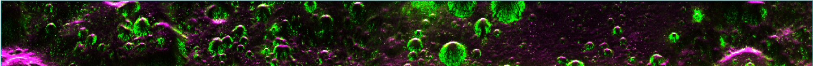

<a href="https://vrmvikas.github.io/"> Home </a>| <a href = "https://vrmvikas.github.io/CV/">CV</a> | <a href="https://vrmvikas.github.io/about/"> About </a>|<a href = "https://vrmvikas.github.io/experimental/"> Experiments</a>

# Curriculum Vitae

<table>
  <tr>
    <td> IISc Bangalore </td>
    <td> 2021 - 2023 </td>
    <td> M.Tech</td>
    <td rowspan="2"> Electronics and Communication Engineering </td>
  </tr>
  <tr>
    <td> IIIT Allahabad </td>
    <td> 2017 - 2021 </td>
    <td> B.Tech</td>
  </tr>
</table>

- Albeit an Electronics and Communication majors, my interests evolved from Signal Processing to Image Processing, and all classical to modern techniques used in image processing.
- Machine Learning / Deep Learning form the pillar stones in all such analysis techniques, and as is the trend to not limit the studies in one-domain but encorporate informations from other modalities as well, the next logical step came with growing interests in LLMs / VLMs and NLP in general.

## Research Works / Academic Projects

### Multi-modal Fake News Detection

Developing robust Fake News Detection Frameworks with multi-modal capabilities:

- Developed pipeline for automated curation of Indigenous datasets of fake news using smart web-scraping, including pre-processing to extract high-quality data samples

- Fine-tuned CLIP vision-language model, incorporating prompt tuning techniques, which resulted in [SOTA accuracy](https://arxiv.org/pdf/2311.16496.pdf).
- Exploring explainability in fake news detection frameworks incorporating LLMs

### DFSAR Analysis of Chandrayaan-2

Dual Frequency SAR - (Synthetic Aperture Radar) Analysis

The project involved the implementation of algorithms for the estimation of dielectric constants from Fully Polarimetric SAR Radar Imaging data for reducing ambiguities regarding the presence of Water-Ice in polar lunar craters.

An example of a SAR-Radar image shown in RGB. The three colour channels are each assigned to three different kinds of scattering effect of radio waves, with green channel representing the "Volumetric Scattering", which most closely resembles the scattering pattern of the much prized water-ice. 

- Note the green walls which only mostly are seen on/around crater walls - regions which are permanently shadowed from sunlight and hence are most likely to still contain water ice.
- The long stretched shape of the image is a result of how a SAR-radar would scan the land as it orbits around the moon.

### RBMLE

- Implementation and study of the **Reward Biased Maximum Likelihood Estimation (RBMLE)** method to solve the “exploration v/s exploitation problem” in adaptive control of Markov Decision Processes in Reinforcement Learning tasks.
- Modeled the finite-time performance of RBMLE in Reinforcement Learning tasks, involving the problem of optimal control of unknown Markov Decision Processes.
