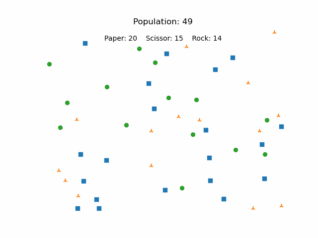

<table border="0">
 <tr>
    <td>
### Vikas Verma
**Research Assistant  | Image Analysis and Computer Vision Lab, IISc Bangalore**

I am currently working as an RA with IISc Bangalore on a research project funded by CAIR, DRDO. My current project involves developing novel techniques in multi-modal domain to detect Fake News. It also involves finetuning large vision-language models and studying/repurposing them for various downstream tasks.</td>
    <td></td>
 </tr>
 <tr>
    <td>Lorem ipsum ...</td>
    <td>Lorem ipsum ...</td>
 </tr>
</table>

#### Rock-Paper-Scissor (Simulation)

An environment is initialized containing a total of (n=50 in the case below) independent agents belonging to either of the three classes (Rock, Paper, and Scissor). Each agent follows an independent policy and tries to survive for the longest time. Changing their policies gives rise to some interesting patterns to observe, an example of which is shown below

