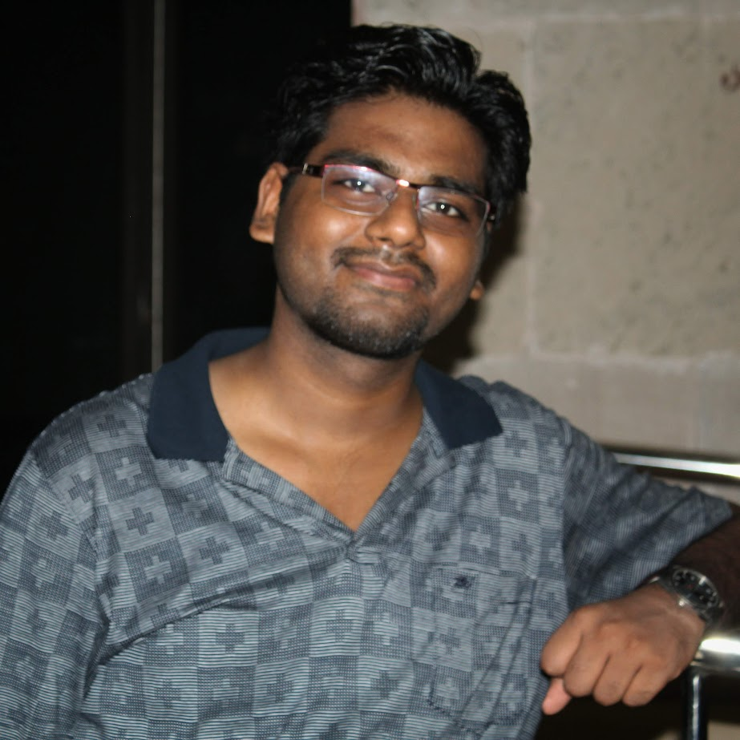

<a href="https://vrmvikas.github.io/"> Home </a>| <a href = "https://vrmvikas.github.io/CV/">CV</a> | <a href="https://vrmvikas.github.io/about/"> About </a>|<a href = "https://vrmvikas.github.io/experimental/"> Experiments</a>

### Vikas Verma 
**Research Assistant  | Image Analysis and Computer Vision Lab, IISc Bangalore | July 2023 -** 

<table border="0">
 <tr>
    <td>

I am working as an RA with IISc Bangalore on a research project funded by CAIR, DRDO. My current project involves developing novel techniques in the multi-modal domain to detect Fake News. It also includes finetuning large vision-language models and studying/repurposing them for various downstream tasks.</td>
    <td>
</td>
 </tr>
</table>

### Publications / Contributions:

#### Leveraging Out-of-Domain Data for Domain-Specific Prompt Tuning in Multi-Modal Fake News Detection. 
Brahma, D., Bhattacharya, A., Mahadev, S.N., Asati, A., Verma, V. and Biswas, S., 2023.

[arXiv preprint](https://arxiv.org/pdf/2311.16496)

